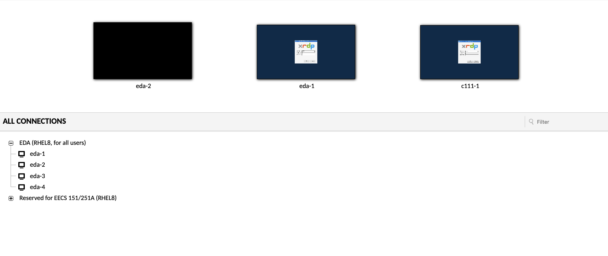

# fpga-labs-fa24
Welcome to the repository for EECS 151/251A Fall 2024 FPGA labs! This repository will contain all the information you need to complete lab exercises. If you are just getting started make sure to see the [Setup](#Setup) section to create your environment.

## Lab Policies

1. Collaboration is encouraged, but all work must be individual
3. Do not run heavy workloads on lab computers, use EDA servers instead
4. Check-offs must be done in person
5. All labs must be checked off **before** your next lab session. 

## Setup <a name="paragraph1"></a>

<details open>
  <summary>See Instructions</summary>

### Getting an Instructional Account

You are required to get an EECS instructional account to login to the workstations in the lab and the EDA servers, since you will be doing all your work on these machines (whether you're working remotely or in-person). 

1. Visit WebAcct: http://inst.eecs.berkeley.edu/webacct.
2. Click "Login using your Berkeley CalNet ID"
3. Click on "Get a new account" in the *eecs151* row. 

Once the account has been created, you can email your class account form to yourself to have a record of your account information.  You can follow the instructions on the emailed form to change your Linux password with `ssh update.eecs.berkeley.edu` and following the prompts.


### Logging into the Classroom Servers

The workstations used for this class are `c111-[1-20].eecs.berkeley.edu` (which are physically located in Cory 111) and `eda-[1-4].eecs.berkeley.edu` (higher performance servers). You can access all of these machines remotely through SSH or remote desktop. 

NOTE: Each of the Cory 111 machines is connected to one FPGA board. You should only program the FPGAs when you are physically in the lab, and you should make sure that you are programming from the machine you are physically using. You don't need to be present in the lab to write Verilog or run simulations, and you can do these tasks on any c111 or eda machine.

#### SSH: 

How To:
<ul style="list-style: none;">
 <li>
<details>
<summary>Linux, BSD, MacOS</summary>
<br>

Access your workstation through SSH by running:

```shell
ssh eecs151-YYY@eda-X.eecs.berkeley.edu
```

In our examples, this would be:

```shell
ssh eecs151-abc@eda-4.eecs.berkeley.edu
```
</details>
</li>
 <li>
<details>
<summary>Windows</summary>
<br>
The classic and most lightweight way to use SSH on Windows is PuTTY (https://www.putty.org/). Download it and login with the FQDN above as the Host and your instructional account username. You can also use WinSCP (winscp.net) for file transfer over SSH.

Advanced users may wish to install Windows Subsystem for Linux (https://docs.microsoft.com/en-us/windows/wsl/install-win10, Windows 10 build 16215 or later) or Cygwin (cygwin.com) and use SSH, SFTP, and SCP through there.

</details>
</li>
</ul>


It is ***highly*** recommended to utilize one of the following SSH session management tools: `tmux` or `screen`. This would allow your remote terminal sessions to remain active even if your SSH session disconnects, letting you keep long-running jobs active. Below are tutorials for both:
* [Tmux Tutorial](https://www.hamvocke.com/blog/a-quick-and-easy-guide-to-tmux/)
* [Screen Tutorial](https://www.rackaid.com/blog/linux-screen-tutorial-and-how-to/)


#### INST RDP

For situations in which you need a graphical interface (waveform debugging, layout viewing, etc.) use the in-browser RDP website.

First access https://instrdp.eecs.berkeley.edu/#/ and login with your Calnet ID. There should be a dropdown with the machines you can RDP in to (EDA and c111). Once you click on a machine, login with your EECS instructional account to access a desktop.

<p align="center">

</p>

Take a look at [this page](https://inst.eecs.berkeley.edu/cgi-bin/pub.cgi?file=guacamole.help) for more information.


### Create Subdirectory for Work
Before you begin exercises, you need to create a directory for your work. Your `/home` directory has limited space, therefore you will create a personal subdirectory underneath `/home/tmp/<your-eecs-username>` for all development work (copy any important results to your home directory). 

Steps: 
1. Log into the EECS Instructional WebAccount (http://inst.eecs.berkeley.edu/webacct) with your CalNet ID. 
2. Click on "*More...*"
3. Select "*Make /home/tmp Directory*"

<p align="center">

</p>

### Remote Access

It is important that you can remotely access the instructional servers. Remote into server using either SSH (Secure SHell) or INST RDP. The range of accessible machines are `eda-[1-4]` and `c111-[1-20]`. The fully qualified DNS name (FQDN) is `eda-X.eecs.berkeley.edu` or `c111-X.eecs.berkeley.edu`. For example, if you select machine `eda-4`, the FQDN would be `eda-4.eecs.berkeley.edu`.

<!-- Next, note your instructional class acccount name - the one that looks like `eecs151-YYY`, for example `eecs151-abc`. This is the account you created at the start of this lab. -->

#### VPN
If you're not on campus connected to *eduroam*, you need to use a global protect VPN to get over the instructional machine's firewall. Follow this guide to install the VPN: https://software.berkeley.edu/bsecure-remote-access-vpn

</details>


## Clone this Repo

You are now ready to complete the lab exercises!


Clone the repo to your work directory.

```shell
cd /home/tmp/<your-eecs-username>
git clone git@github.com:EECS-151/fpga-labs-fa24.git
```
Now, `cd` into the cloned directory. 

It may be the case that staff needs to make an update on already released labs, and if you have already edited skeleton code you may run into a merge conflict. 
In this case you will have to tell git which changes you want to keep, check out [this link](https://docs.github.com/en/pull-requests/collaborating-with-pull-requests/addressing-merge-conflicts/resolving-a-merge-conflict-using-the-command-line) for a quick way to deal with such merge conflicts.